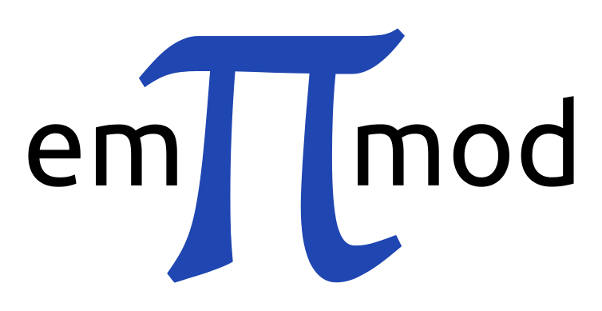

### 3D EM modeller for 1D VTI media

The modeller **empymod** can calculate electric or magnetic responses due to a
3D electric or magnetic source in a layered-earth model with vertical
transverse isotropic (VTI) resistivity, VTI electric permittivity, and VTI
magnetic permeability, from very low frequencies (DC) to very high frequencies
(GPR). The calculation is carried out in the wavenumber-frequency domain, and
various Hankel- and Fourier-transform methods are included to transform the
responses into the space-frequency and space-time domains.

- <i class="fas fa-book fa-lg"></i> Manual: [empymod.rtfd.org](https://empymod.readthedocs.io) 
    - <i class="fas fa-copy fa-lg"></i> [Feature-list](https://empymod.readthedocs.io/en/stable/index.html#features)
    - <i class="fas fa-laptop-code fa-lg"></i> [Installation guide](https://empymod.readthedocs.io/en/stable/index.html#installation)  
- <i class="fas fa-scroll fa-lg"></i> Examples: [empymod-examples](https://github.com/empymod/empymod-examples)
- <i class="fas fa-balance-sacle fa-lg"></i> License: [Apache-2.0](http://www.apache.org/licenses/LICENSE-2.0)
- <i class="fab fa-python fa-lg"></i> Requirements: Python 3.5+; NumPy, SciPy, (numexpr)

 

 

### Multigrid solver for 3D EM diffusion

The modeller **emg3d** is a multigrid solver for 3D EM diffusion with tri-axial
electrical anisotropy. The matrix-free solver can be used as main solver or as
preconditioner for Krylov subspace methods, and the governing equations are
discretized on a staggered Yee grid.

**Useful links:**
- <i class="fas fa-book fa-lg"></i> Manual: [emg3d.rtfd.org](https://emg3d.readthedocs.io)
    - <i class="fas fa-copy fa-lg"></i> [Feature-list](https://emg3d.readthedocs.io/en/stable/index.html#features)
    - <i class="fas fa-laptop-code fa-lg"></i> [Installation guide](https://emg3d.readthedocs.io/en/stable/index.html#installation)
- <i class="fas fa-scroll fa-lg"></i> Examples: [emg3d-examples](https://github.com/empymod/emg3d-examples)
- <i class="fas fa-balance-sacle fa-lg"></i> License: [Apache-2.0](http://www.apache.org/licenses/LICENSE-2.0)
- <i class="fab fa-python fa-lg"></i> Requirements: Python 3.7+; NumPy, SciPy, Numba, discretize (from SimPEG)

 

## Contributing

- <i class="fab fa-github fa-lg"></i>
  [empymod GitHub page](https://github.com/empymod)  
  Submit bugs, fix typos, contribute code, and so much more!
- <i class="fab fa-slack fa-lg"></i>
  [SimPEG on Slack](http://slack.simpeg.xyz)  
  Join the Slack channel &laquo;em-x-d&raquo; of [SimPEG](https://simpeg.xyz).
- <i class="fas fa-bookmark fa-lg"></i>Cite us:

  If you publish results for which you used our codes, please give credit by
  citing us.

    - <i class="fas fa-code fa-lg"></i> **empymod**  
      

      > Werthmüller, D., 2017, An open-source full 3D electromagnetic modeler
      > for 1D VTI media in Python: empymod: Geophysics, 82(6), WB9--WB19; DOI:
      > [10.1190/geo2016-0626.1](http://doi.org/10.1190/geo2016-0626.1).

    - <i class="fas fa-code fa-lg"></i> **emg3d**  
      A Zenodo-DOI and citation will follow soon.

  You can find a list of all articles related to *empymod* and *emg3d* in the
  [publications-repo](https://github.com/empymod/publications).
